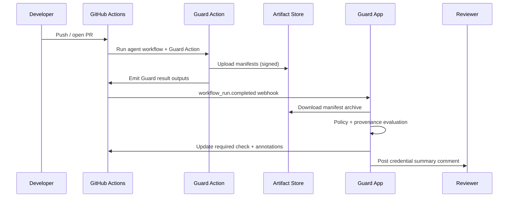

# Architecture & Flow

Eval gates: Agent HQ Guard: block unauthorized agents; detect protected-path writes; require provenance; checks gate merges.

## High-Level Components

- **GitHub App (Probot)** – Receives webhooks, loads policy, verifies provenance, updates checks, publishes mission-control decisions.
- **GitHub Action** – Runs in workflows, validates manifests locally, writes result JSON, fails fast when guardrails break.
- **Policy & Provenance Libraries** – Shared code for parsing YAML → Rego, credential hashing, signature checks, and markdown summaries.
- **CLI** – Simulates workflows locally to test policies and manifests before opening PRs.
- **Examples** – Ready-made workflows showing success and failure paths (parallel agents, protected-path violation).

## Detailed Flow (Compatibility Path)

## Mission Control Flow (Native API)

1. Guard detects `AGENT_HQ_API_URL` and instantiates the mission-control client.
2. Before each tool execution, Guard publishes `allow/deny` with reasons and remaining token budget.
3. Client retries network/transient failures three times with exponential backoff.
4. Human-readable credential summaries still appear on the PR for audit.

## Deployment Topology

- **Docker Compose** (local R&D): Node app, Postgres, Redis, OPA, OTEL collector.
- **Production**: Deploy the app wherever you run Node services (Fly.io, Heroku, Kubernetes). Provide Postgres or sqlite persistence as desired. Use OIDC to sign releases with cosign.

Guard keeps policy, provenance, and budget logic centralized while meeting both native Agent HQ and compatibility requirements.
