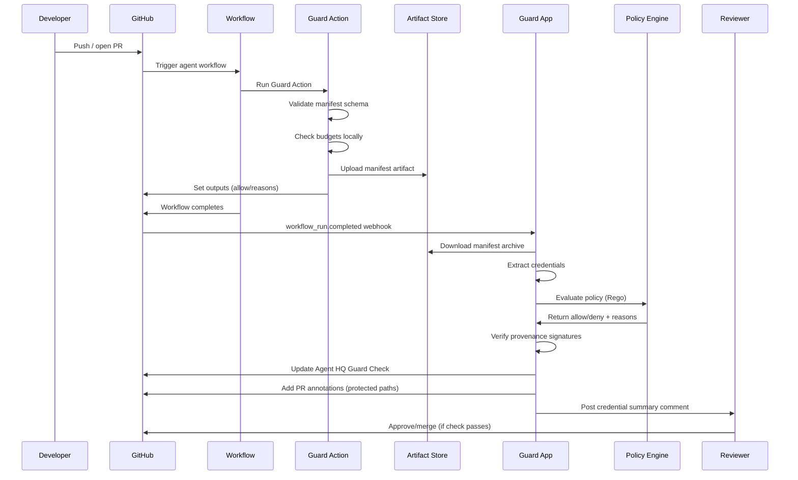
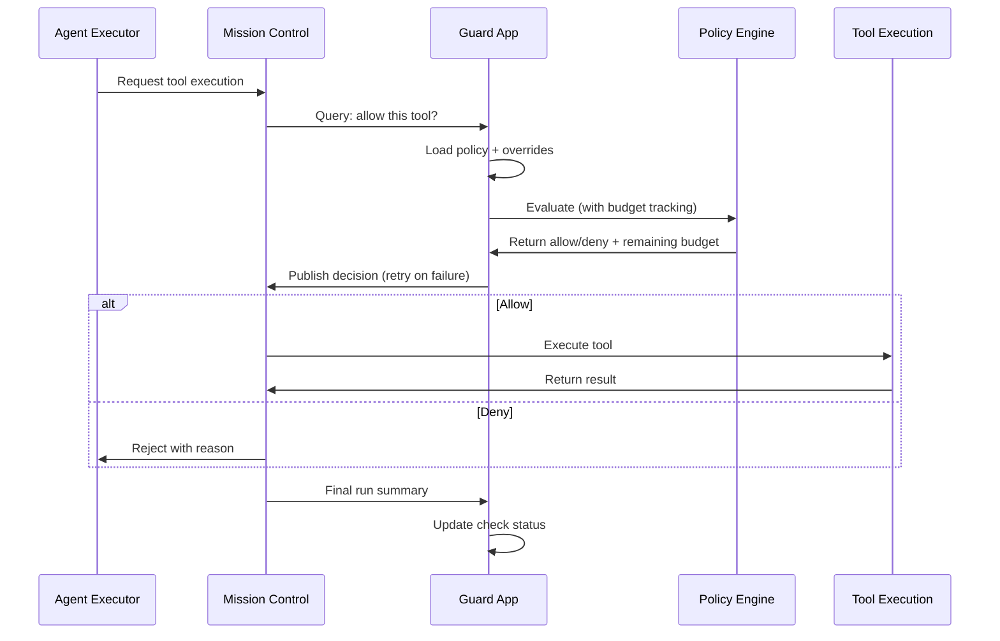
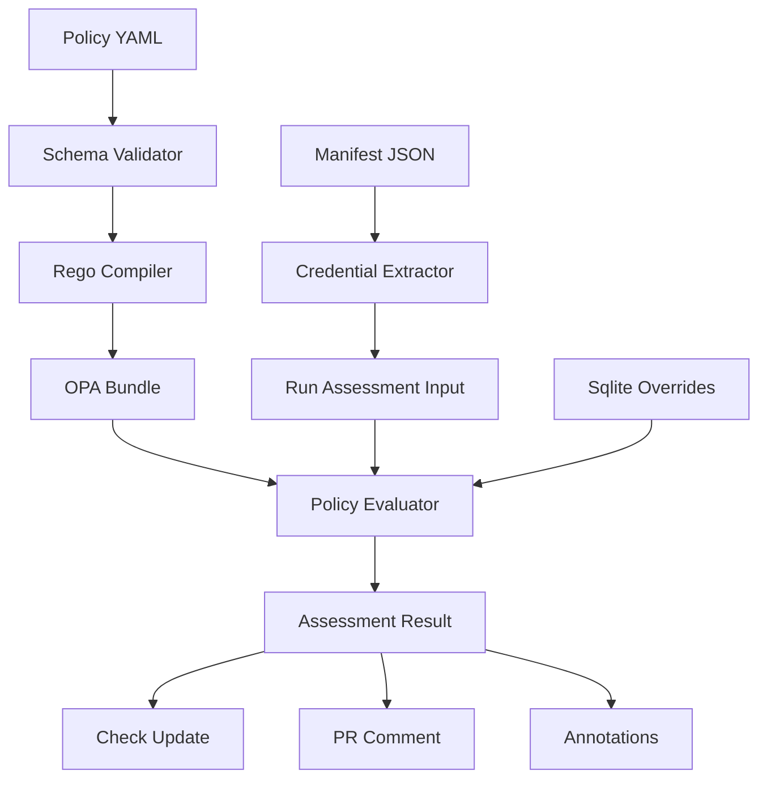

# Agent HQ Guard: Architecture & Flow

> **Understanding how Agent HQ Guard works under the hood**

This document explains the system architecture, data flows, and deployment topologies for Agent HQ Guard. It's designed for architects, DevOps engineers, and anyone who needs to understand how Guard integrates with GitHub's ecosystem.

## High-Level Architecture

Agent HQ Guard consists of five main components:

```
┌─────────────────┐     ┌──────────────────┐     ┌─────────────────┐
│   GitHub App    │────▶│  Policy Engine   │────▶│   Evaluator     │
│   (Probot)      │     │  (YAML → Rego)   │     │   (OPA)         │
└─────────────────┘     └──────────────────┘     └─────────────────┘
         │                        │                         │
         │                        │                         │
         ▼                        ▼                         ▼
┌─────────────────┐     ┌──────────────────┐     ┌─────────────────┐
│  GitHub Action  │     │  Provenance Lib   │     │   Storage       │
│  (Workflow)     │     │  (Sigstore/C2PA)  │     │   (SQLite)      │
└─────────────────┘     └──────────────────┘     └─────────────────┘
```

### Component Responsibilities

| Component | Purpose | Technology |
|-----------|---------|------------|
| **GitHub App** | Receives webhooks, orchestrates evaluation, updates checks | Probot (Express) |
| **GitHub Action** | Validates manifests in CI/CD, fails fast | TypeScript/Node |
| **Policy Engine** | Compiles YAML policies to Rego, validates schema | Rego/OPA |
| **Provenance Library** | Validates signatures, renders summaries | Sigstore/C2PA |
| **Storage** | Persists overrides, caches policies | SQLite |
| **CLI** | Local simulation and testing | TypeScript |

## Detailed Flow: Compatibility Path

The compatibility path works with any GitHub Actions workflow, using GitHub's Checks API to block merges.



### Key Decision Points

1. **Local Validation (Action)** — Fast feedback in workflow, fails before artifact upload
2. **Policy Evaluation (App)** — Full policy check with OPA, considers overrides
3. **Provenance Verification (App)** — Signature validation, Rekor lookups
4. **Check Update (App)** — Final decision posted to GitHub Checks API

## Native Mission Control Flow

When `AGENT_HQ_API_URL` is set, Guard publishes decisions upstream before tools execute.



### Benefits of Native Flow

- ✅ **Proactive enforcement** — Blocks before wasted compute
- ✅ **Budget tracking** — Real-time token consumption monitoring
- ✅ **Tool-level control** — Can approve/deny individual tools (future)

### Retry Logic

The mission control client implements exponential backoff:

```
Attempt 1: Immediate
Attempt 2: 1s delay
Attempt 3: 2s delay
Attempt 4: 4s delay
Final: Log warning, continue without upstream decision
```

## Data Flow: Policy Evaluation



### Input Structure

The evaluator receives:

```json
{
  "agent": { "id": "openai-codex" },
  "usage": { "tokens": 1200 },
  "changes": { "files": ["src/index.ts"] },
  "approvals": { "destructive": { "count": 1 } },
  "provenance": { "valid": true },
  "overrides": { "allowed_agents": [], "budget": null }
}
```

### Output Structure

The evaluator produces:

```json
{
  "allow": true,
  "reasons": [],
  "annotations": [
    { "path": "src/infra/config.yaml", "message": "Protected path modified" }
  ]
}
```

## Deployment Topology

### Local Development

```
┌─────────────────────────────────────────────────┐
│ Docker Compose                                  │
│                                                 │
│  ┌──────────┐  ┌──────────┐  ┌──────────┐    │
│  │ Guard    │  │ Postgres │  │ Redis    │    │
│  │ App      │  │          │  │          │    │
│  │ :3000    │  │ :5432    │  │ :6379    │    │
│  └──────────┘  └──────────┘  └──────────┘    │
│                                                 │
│  ┌──────────┐  ┌──────────┐                  │
│  │ OPA      │  │ OTEL      │                  │
│  │ :8181    │  │ Collector │                  │
│  └──────────┘  └──────────┘                  │
└─────────────────────────────────────────────────┘
```

### Production Deployment

```
┌─────────────────────────────────────────────────┐
│ Load Balancer / Ingress                         │
│  ┌──────────────────────────────────────────┐  │
│  │ Guard App (Replicas)                    │  │
│  │  - Health: /healthz, /readyz            │  │
│  │  - Webhook: /api/github/webhooks        │  │
│  └──────────────────────────────────────────┘  │
│                    │                            │
│         ┌──────────┴──────────┐                │
│         │                     │                 │
│    ┌────▼────┐         ┌──────▼─────┐          │
│    │ Postgres│         │   SQLite   │          │
│    │ (Shared)│         │ (Per App)  │          │
│    └─────────┘         └───────────┘          │
│                                                 │
│         ┌──────────┐                           │
│         │   OPA    │                           │
│         │ (Bundle) │                           │
│         └──────────┘                           │
└─────────────────────────────────────────────────┘
```

### Recommended Production Setup

- **App Deployment:** Fly.io, Heroku, Kubernetes, or GitHub Actions self-hosted runner
- **Database:** Postgres for production (sqlite for local)
- **Policy Engine:** OPA bundle deployed separately or embedded
- **Monitoring:** OTEL collector → your observability stack
- **Secrets:** Use provider secrets management (Fly secrets, K8s secrets, etc.)

## Security Architecture

### Authentication Flow

```
GitHub → Webhook Secret → App (Validates)
GitHub → App Private Key → GitHub API (Authenticated Requests)
App → OPA → Policy Evaluation (No auth needed, internal)
App → Mission Control → API Key (if configured)
```

### Provenance Verification

```
Manifest → Schema Validation → Credential Extraction
Credential → Signature Check → Rekor Lookup → C2PA Verification
Result → Summary Generation → PR Comment
```

### Data Isolation

- **Per-repository policies** — Each repo has its own `.github/agent-hq-guard.yml`
- **Sqlite per-instance** — Overrides stored locally (not shared)
- **Artifact storage** — GitHub's artifact system (isolated per org/repo)

## Performance Characteristics

### Latency Breakdown

| Step | Typical Latency | Notes |
|------|----------------|-------|
| Webhook receipt | < 100ms | Network-dependent |
| Policy load | < 50ms | Cached after first load |
| OPA evaluation | < 10ms | Rego is fast |
| Provenance check | < 200ms | Sigstore API calls |
| Check update | < 100ms | GitHub API |
| **Total** | **< 500ms** | End-to-end |

### Scalability Considerations

- **Stateless design** — App instances can scale horizontally
- **Policy caching** — Policies cached per-repository
- **Sqlite limitations** — Consider Postgres for high-throughput
- **Mission control retries** — Async with exponential backoff

## Integration Points

### GitHub APIs Used

- **Checks API** — Create/update check runs
- **Pull Requests API** — Read PR state, create comments
- **Contents API** — Read policy files
- **Artifacts API** — Download workflow manifests
- **Issues API** — Process slash commands

### External Services

- **Sigstore** — Signature verification
- **Rekor** — Transparency log queries
- **Mission Control** — (Optional) Upstream decision publishing

## Observability

### Logs

Guard uses Probot's pino logger with structured logging:

```json
{
  "level": "info",
  "msg": "Policy evaluation complete",
  "repo": "owner/repo",
  "pr": 123,
  "allow": true,
  "reasons": []
}
```

### Metrics (Recommended)

Track these metrics:
- `guard_evaluations_total` — Total policy evaluations
- `guard_allows_total` — Policy passes
- `guard_blocks_total` — Policy failures
- `guard_overrides_total` — Slash command usage
- `guard_mc_retries_total` — Mission control retry counts

### Health Endpoints

- `GET /healthz` — Always returns 200 (liveness)
- `GET /readyz` — Returns 200 if storage + mission control ready

## Failure Modes & Resilience

### Policy Load Failure

- **Behavior:** Check remains in "pending" state
- **Recovery:** Retry policy load on next webhook
- **Monitoring:** Alert on persistent load failures

### OPA Unavailable

- **Behavior:** Check fails with "policy engine unavailable"
- **Recovery:** OPA should be highly available (HA deployment)
- **Monitoring:** OPA health checks

### Mission Control Unreachable

- **Behavior:** Retry 3x, then log warning
- **Impact:** Check status still determined by policy/provenance
- **Recovery:** Guard continues working without upstream publishing

### Artifact Download Failure

- **Behavior:** Check fails with "manifest not found"
- **Recovery:** Re-run workflow to upload artifact
- **Monitoring:** Alert on artifact download failures

## Future Architecture Enhancements

- **Distributed policy cache** — Redis-backed cache for multi-instance deployments
- **Streaming decisions** — WebSocket updates for real-time policy changes
- **Multi-cloud support** — Abstract GitHub APIs for other platforms
- **Policy versioning** — Track policy changes over time

---

**Next Steps:** See [Operator Guide](operator-guide.md) for deployment runbooks, or [Policy Reference](policy-reference.md) for policy authoring.