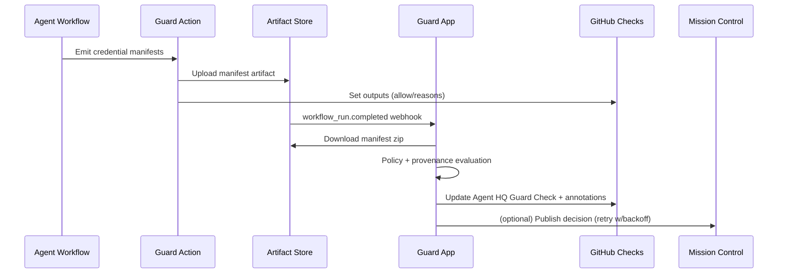

# Operator Guide

Eval gates: Agent HQ Guard: block unauthorized agents; detect protected-path writes; require provenance; checks gate merges.

## Guard Responsibilities

- **Policy enforcement** – Sentinel-compatible YAML drives allowlists, token budgets, protected paths, and approval counts.
- **Provenance verification** – Signed A2PA manifests (Sigstore + in-toto + C2PA bindings) are required before the check passes.
- **Budget governance** – Per-run token ceilings enforced at workflow and PR levels.
- **Override workflows** – Maintainers can issue `/agent-allow` and `/budget` slash commands; everything is auditable and logged.

## Runtime Architecture

## Operational Runbook

### Health & Observability

- **Health endpoints:**
  - `/healthz` – liveness check.
  - `/readyz` – readiness check (includes sqlite ping + mission-control flag).
    Front them with your uptime monitor or Kubernetes probes.
- Logs emit via Probot’s pino logger; ship them into your OTEL collector (included in `docker-compose.yml`).
- Track metrics such as guard passes/blocks, slash command overrides, and mission-control retry counts.

### Incident Response

1. **Check fails unexpectedly**
   - Inspect PR annotations for reasons.
   - Review `tmp/agent-hq-guard-result.json` or workflow artifact.
   - Re-run Guard Action locally with CLI to reproduce.
2. **Provenance validation failure**
   - Confirm agent workflow uploaded manifest artifact.
   - Run `cosign verify-blob` with expected Rekor UUID.
   - Confirm tokens or budgets not mutated by manual edits.
3. **Mission control unreachable**
   - Guard retries 3x with exponential backoff; final failure surfaces as a warning.
   - Use `AGENT_HQ_API_URL` feature flag to disable while upstream is degraded.

### Overrides & Governance

- `/agent-allow @provider` – grants temporary access for the PR; stored in sqlite overrides table.
- `/budget 50k_tokens` – raises/lowers token ceiling for the PR.
- All overrides are echoed back into the PR via bot comments and logged for audit.
- Plan to purge overrides on merge (future improvement) or schedule `DELETE` job.

### Data Retention & Privacy

- Manifests are hashed; raw artifacts never stored beyond sqlite override metadata.
- Delete credentials by removing artifacts; Guard stores only references.
- Compose stack uses Postgres and Redis for other services; Guard itself currently uses sqlite embedded.

### Security Controls

- SBOM + cosign signing built into CI pipeline.
- Strict `shared-workspace-lockfile` and `strict-peer-dependencies` via `.npmrc`.
- Dependabot configuration keeps npm dependencies and workflows patched weekly.
- Mission control publishing hardened with retries, structured error surfacing, and audit logging hooks.

## Maintenance Tasks

- `pnpm check` before every release.
- Review coverage reports uploaded from CI (artifact `coverage`).
- Rotate GitHub App credentials and cosign identities quarterly.
- Keep policy bundle in `lib/policy/bundle/` synchronized with compiled Rego.
- Document new slash commands or policy keys in `docs/policy-reference.md`.

## Branch Protection Template

1. Require pull request reviews (minimum 1).
2. Require status check **Agent HQ Guard**.
3. Optionally require SBOM upload job success.
4. Enable dismiss stale reviews when new commits land.

Guard gives you deterministic enforcement, visibility, and human-in-the-loop controls for every autonomous run.
